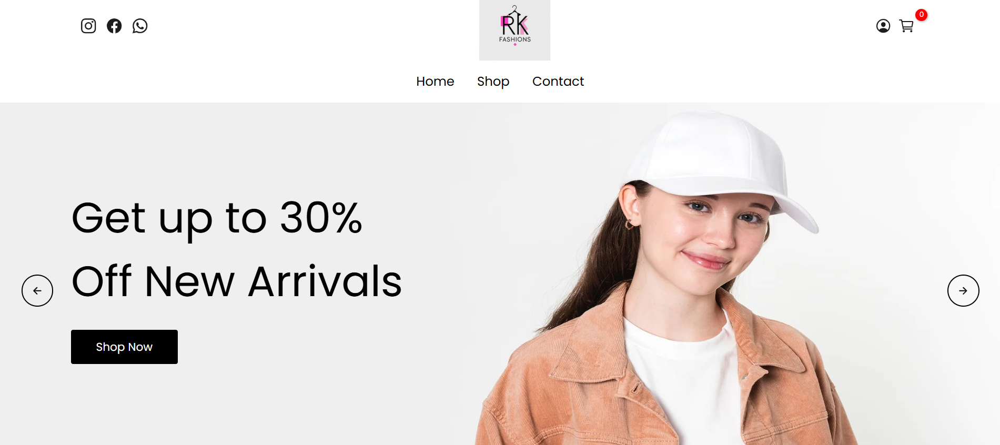

# E-Commerce Landing Page

A simple, responsive landing page for an e-commerce website featuring a promotional banner.



## **Features**
- Clean and modern design
- Responsive layout (works on mobile & desktop)
- Promotional banner with "Shop Now" call-to-action
- Navigation menu (Home, Shop, Contact)

## **Technologies Used**
- HTML5
- CSS3 (Flexbox for layout)
- No external dependencies (pure HTML/CSS)

## **Files Included**
- `index.html` - Main page structure
- `style.css` - Styling for the page
- `image.png` - Screenshot of the design
- `README.md` - This documentation file

## **How to Use**
1. Clone this repository:
   ```bash
   git clone https://github.com/your-username/ecommerce-landing.git
